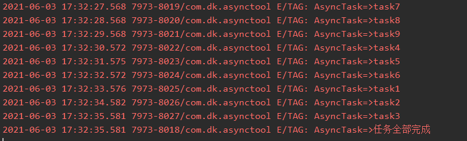

# 异步组件[](https://jitpack.io/#Doonkey/AsyncTool)

### 组件说明

按组执行的异步任务

#### 导入依赖

Step 1. 添加JitPack仓库到根目录build.gradle文件

allprojects {
		repositories {
			...
			maven { url 'https://jitpack.io' }
		}
	}

Step 2. 在module添加依赖

dependencies {
	        implementation 'com.github.Doonkey:AsyncTool:Tag'
	}

#### 使用


#### 1.task继承SubThreadTask或者NormalThreadTask

 ```Java
 public class AsyncTask1 extends SubThreadTask {
 
     public AsyncTask1(String taskName) {
         super(taskName);
     }
 
     @Override
     public void startTask(CountDownLatch countDownLatch) {
         SystemClock.sleep(1000);
         Log.e("TAG", "AsyncTask=>"+getTaskName());
         if (countDownLatch != null){
             countDownLatch.countDown();
         }
     }
 }
 ```


#### 2.使用GroupTask装载任务，并使用start(listener)开始执行

 ```Java
 /**
      * 情况1：在group2之前的任务，与group不分先后，谁先来就先执行
      * 情况2：在group2之后的任务，则先执行完了group2之后才会执行
      */
     private void addTask(){
         GroupTask group1 = new GroupTask("group1");
         GroupTask group2 = new GroupTask("Group2");
         GroupTask group3 = new GroupTask("Group3");
         AbsTask absTask1 = new AsyncTask1("task1");
         AbsTask absTask2 = new AsyncTask2("task2");
         AbsTask absTask3 = new AsyncTask3("task3");
         AbsTask absTask4 = new AsyncTask4("task4");
         AbsTask absTask5 = new AsyncTask5("task5");
         AbsTask absTask6 = new AsyncTask6("task6");
         AbsTask absTask7 = new AsyncTask7("task7");
         AbsTask absTask8 = new AsyncTask8("task8");
         AbsTask absTask9 = new AsyncTask9("task9");
         group1.addTask(group2, absTask1, absTask2, absTask3);
         group2.addTask(group3, absTask4, absTask5, absTask6);
         group3.addTask(absTask7, absTask8, absTask9);
         group1.start(() -> Log.e("TAG", "AsyncTask=>任务全部完成"));
     }
 ```


#### 执行结构如下，解释说明




